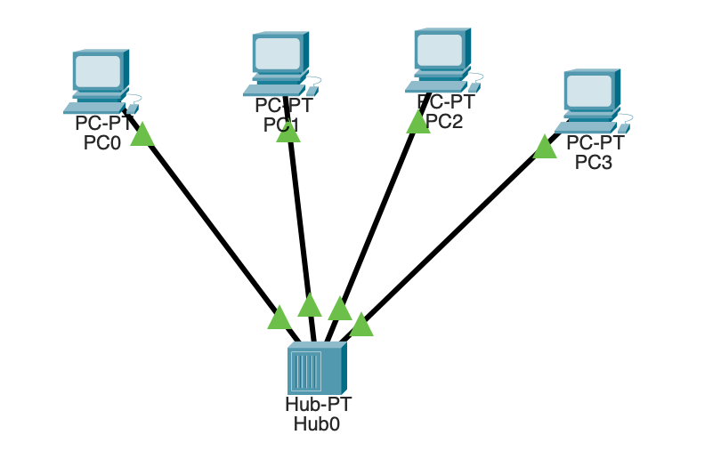
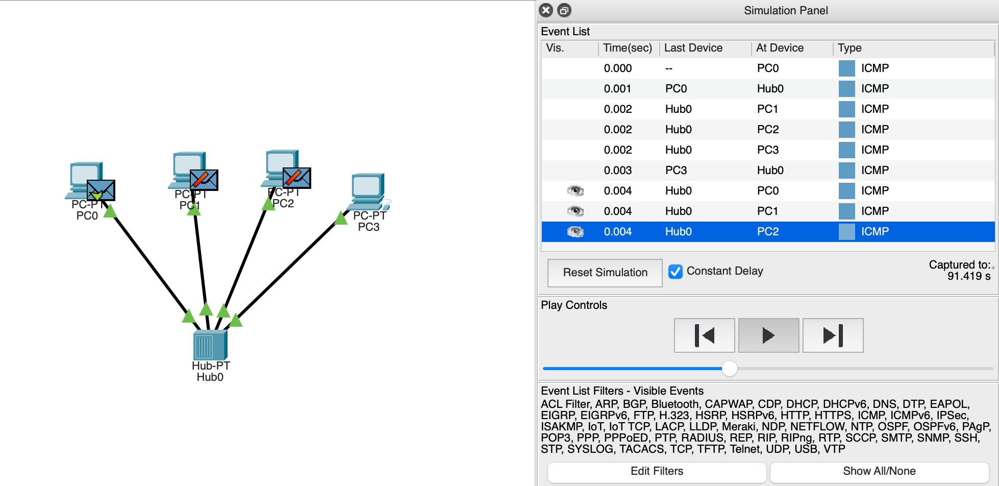
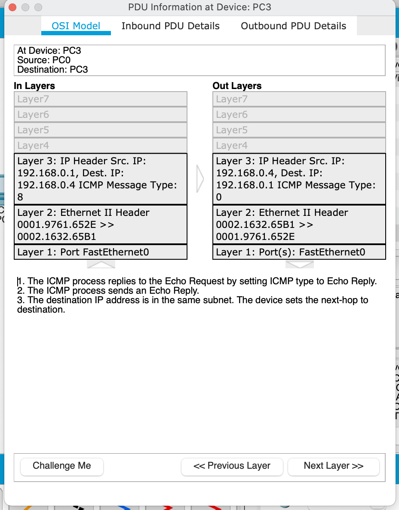
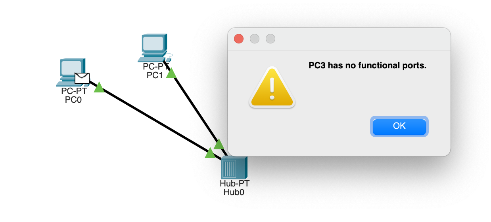
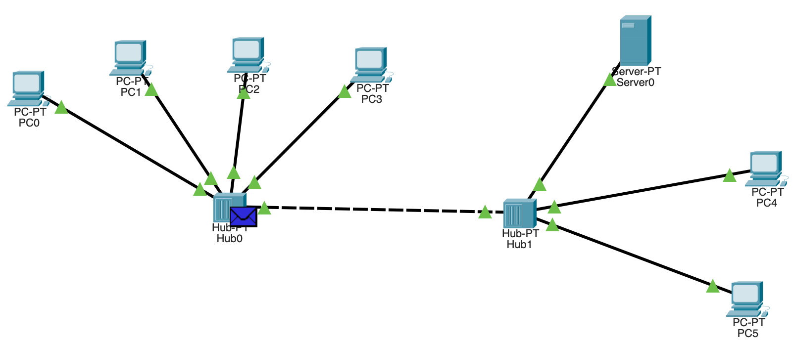
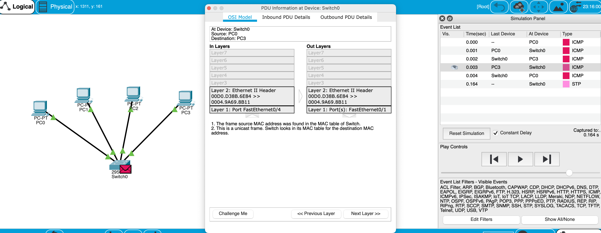
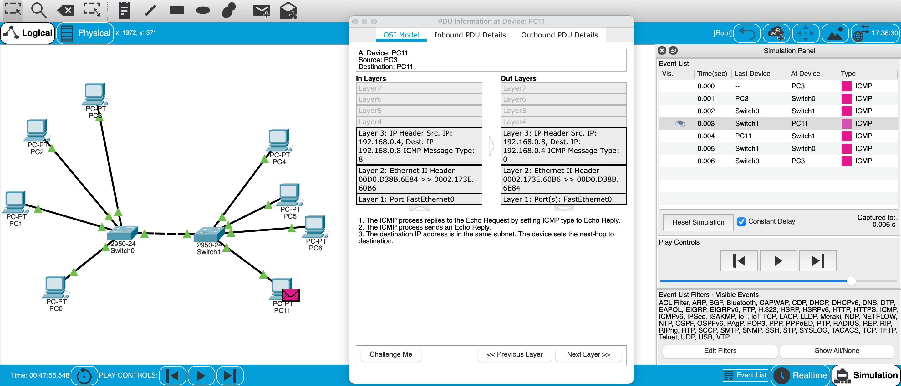

### Topology 1.

### Road of packages.

### Packages event list.

### OSI packages traces.

### Attempt after removing IPs, as I understood there is no way to send the packages without static IP or DHCP that will assign IP address.

### Topology 2.

### Topology 3. In topology2(with Hub) sent messages from one port to other ports, message sent by a hub will come to all computers. But only one computer will respond and the response will also go out to every other port on the hub. Therefore, all the computers can receive the message and computers themselves need to decide whether to accept the message. In topology3 switch is able to handle the data and knows the specific addresses to send the message. It can decide which computer is the message intended for and send the message directly to the right computer. Also hub works on the physical layer (OSI Layer 1) while Switch works on the data link layer (Layer 2)

### Topology 4.

