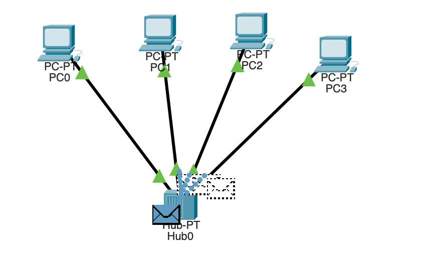

Project 1.

Road of packages.

Packages event list.

OSI packages traces.

Attempt after removing IPs, as I understood the is no way to send the packages without static IP or DHCP that will assign IP address.

