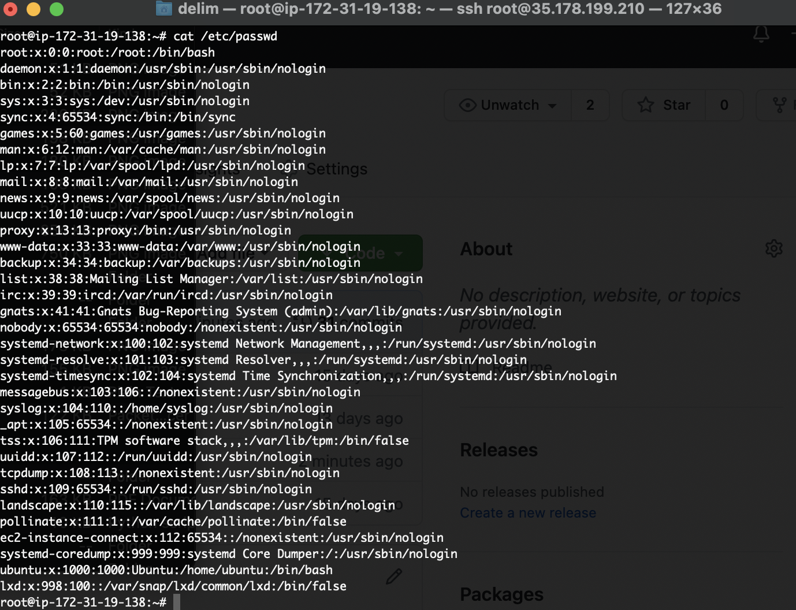
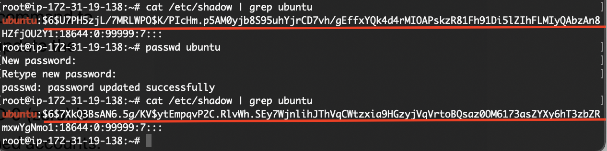

 ### 1.1. Loged in with the root user into my test AWS instace

### 1.2 Password has been changed for user ubuntu, besicatly the changed file is /etc/shadow but the user info can be also found in /etc/passwd.

